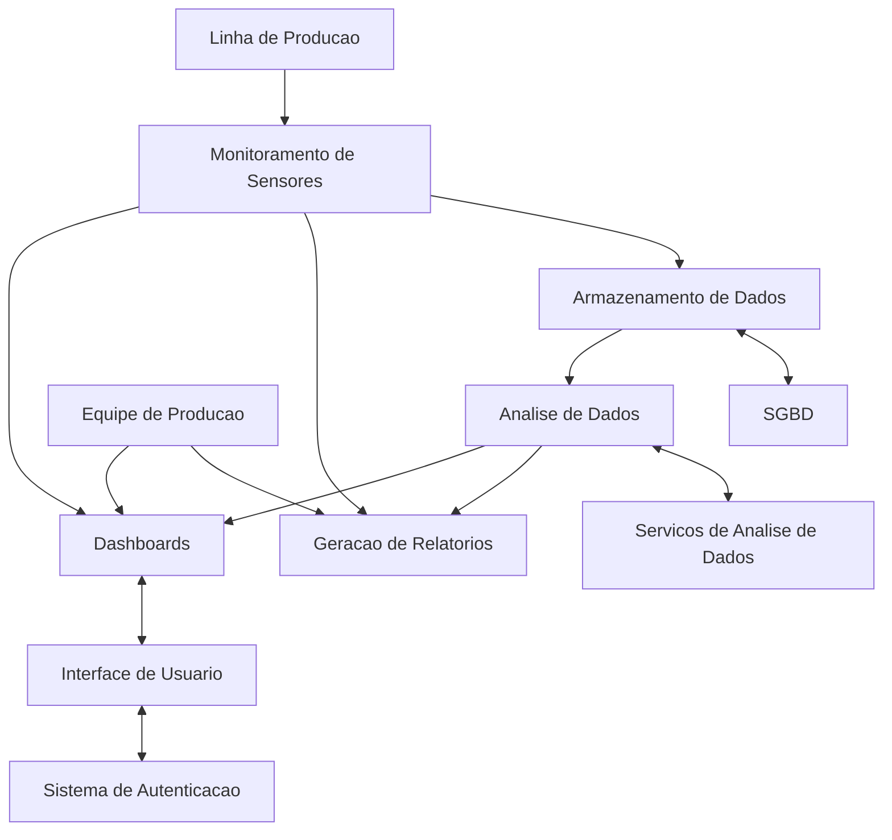
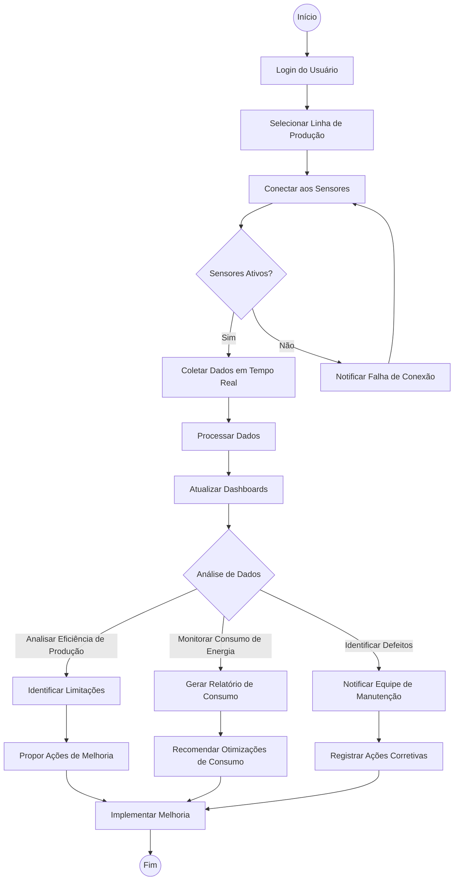

# **Squad IoT: PRD - Product Requirements Document**

## ***Introdução & Objetivo***
- **Introdução:**
No setor automotivo, a correlação entre a qualidade do veículo e a eficiência da produção está intimamente ligada à capacidade de monitorar e analisar dados em tempo real. No entanto, a ausência de um sistema coeso e automatizado para coletar, armazenar e analisar esses dados pode levar a ineficiências, desperdício de recursos e desafios na identificação de problemas na linha de produção.
  

- **Objetivo:**
Nosso objetivo é desenvolver um sistema automatizado de coleta e análise de dados de produção automotiva, com foco na implementação de um dashboard interativo. Esses painéis fornecerão informações detalhadas sobre peças, consumo de energia e defeitos, permitindo uma visibilidade clara e em tempo real dos principais indicadores de desempenho. Além disso, utilizaremos um poderoso banco de dados para armazenar e analisar os dados coletados, fornecendo insights valiosos para ajudar a otimizar a produção, reduzir custos e melhorar a qualidade dos veículos fabricados. Este sistema tornará a nossa gestão mais inteligente e proativa, colocando a nossa empresa numa posição de liderança no setor.

## ***Por que implementar isto?***
Implementar um sistema de coleta e análise de dados de produção automatizado é essencial para a empresa, pois permite transformar a vastidão de dados gerados na linha de produção em informações estratégicas e acionáveis. Com isso, o sistema possibilitará monitoramento contínuo e em tempo real, reduzindo a dependência de processos manuais e minimizando o risco de erros humanos. Isso resulta em uma visão completa e precisa da operação, permitindo a identificação imediata de falhas, ineficiências e oportunidades de melhoria.
  
Além disso, a geração automática de relatórios detalhados e dashboards em tempo real fornecerá à gestão as ferramentas necessárias para tomar decisões mais rápidas e informadas.
  

## ***Organização e Priorização das Ideias***

## ***PÚBLICO-ALVO E PERSONA***

### **Público-alvo** 

Após discussão, definimos que a Kanjiko do Brasil seria a empresa ideal para nosso público-alvo. A Kanjiko do Brasil é uma empresa fabricante de peças e acessórios automotivos, e faz parte do grupo Toyota, com mais de 15 anos de atuação no Brasil.
O projeto se alinha perfeitamente às necessidades de uma empresa que valoriza a excelência operacional e a inovação tecnológica para se destacar no mercado automotivo.

### Personas 

Nome: Paulo  Kojima

Idade: 	43 anos

Cargo: Diretor de Produção na Kanjiko

Objetivos: Como Diretor de Produção, Paulo está sempre buscando formas de otimizar os processos produtivos da Kanjiko. Ele quer reduzir o tempo de inatividade, melhorar o controle de qualidade e garantir que os processos sejam os mais eficientes e sustentáveis possíveis. Paulo também está focado em impulsionar a tecnologia para obter um diferencial competitivo no mercado. 

Desafios: Paulo lida com desafios como a variabilidade na produção, a necessidade de integração de dados de diferentes fontes e a dificuldade de monitorar o consumo de energia e defeitos de forma coesa. Ele busca uma solução que ofereça visibilidade em tempo real e permita a tomada de decisões baseadas em dados concretos.

-------------------------------------------------------------------------------------------------------------------------

Nome: Pedro Franco

Idade: 37 anos.

Cargo: Engenheiro de manutenção  

Experiência: 12 anos na manutenção de linhas de produção automotiva, especialista em diagnóstico e resolução de problemas técnicos.

Objetivos: Minimizar o tempo de inatividade das máquinas, prever falhas antes que ocorram e implementar manutenção preditiva e preventiva.

Desafios: Identificar rapidamente as causas dos problemas, gerenciar a manutenção de diversos equipamentos e garantir que as máquinas funcionem com máxima eficiência.

-------------------------------------------------------------------------------------------------------------------------

Nome: Dorivaldo Jesus

Idade: 52 anos.

Cargo: Gerente de Qualidade

Experiência: 20 anos na área de controle de qualidade, com foco em processos de auditoria e conformidade.

Objetivos: Garantir que todas as peças e processos estejam dentro dos padrões de qualidade estabelecidos, reduzir o número de defeitos e retrabalho.

Desafios: Monitorar em tempo real a qualidade dos produtos, identificar a origem de falhas rapidamente e melhorar a rastreabilidade das peças.

-------------------------------------------------------------------------------------------------------------------------
Nome: Walter Neto 

Cargo: Gerente de Projetos 

Idade: 64 anos

Experiência: Mais de 32 anos na gestão de projetos industriais e automotivos, com um histórico robusto de implementação de projetos complexos em grandes empresas. 

Objetivos: Walter está focado em garantir que os projetos sejam entregues com alta qualidade, alinhados aos objetivos estratégicos da empresa. Ele busca formas de integrar novas tecnologias de forma suave, minimizando riscos e maximizando o retorno sobre o investimento.

Desafios: O volume crescente de dados gerados cria dificuldades na consolidação de informações, e Walter precisa de ferramentas que facilitem a geração de relatórios e a visualização de dados de forma clara e acionável. Por fim, ele precisa garantir que qualquer solução tecnológica adotada esteja alinhada com os objetivos estratégicos da Kanjiko.

-------------------------------------------------------------------------------------------------------------------------
Nome: Giovana Carvalho

Idade: 33 anos

Cargo: Engenheiro de Produção

Experiência: 10 anos na indústria automotiva, com especialização em otimização de processos e gestão de operações produtivas.

Objetivos: Giovana busca constantemente formas de melhorar a eficiência da linha de produção, reduzir desperdícios e aumentar a produtividade. Ela está focada em implementar metodologias ágeis e tecnologias que possam simplificar o fluxo de trabalho e reduzir o tempo de ciclo de produção.

Desafios: Giovana enfrenta desafios como a falta de dados integrados para análise rápida, a necessidade de minimizar paradas inesperadas e a pressão para atender a metas de produção cada vez mais agressivas. Ela também precisa lidar com a complexidade crescente das operações e com a variabilidade na demanda.

-------------------------------------------------------------------------------------------------------------------------
 

## ***Diagrama de Contexto***

## ***Diagrama de Atividade*** 

